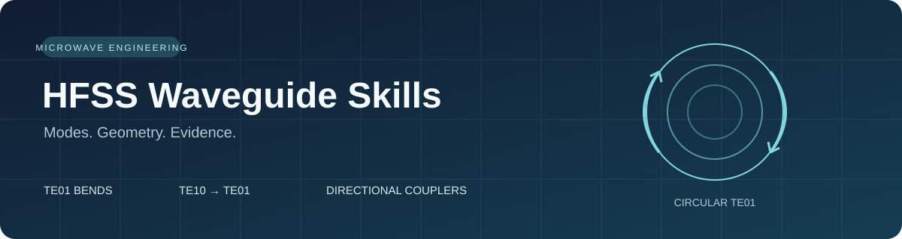
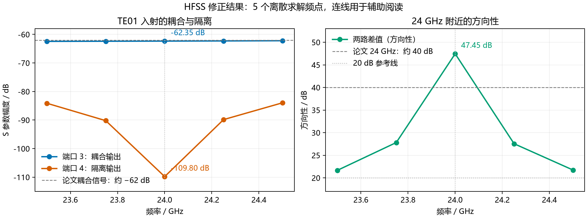

# HFSS 波导仿真 Skills

**把端口模式、几何参数和 S 参数结果连起来，帮助你复刻论文、定位问题、检查仿真证据。**

面向微波与毫米波研究人员、相关专业研究生和 HFSS 工程师。围绕圆波导 TE₀₁，提供弯头、模式转换器和定向耦合器三个可复用的 Agent Skills。

*Reusable Agent Skills for HFSS waveguide engineering: circular TE01 bends, TE10–TE01 mode converters, and two-hole directional couplers.*

[查看三个 Skills](#选择适合你的-skill) · [查看真实案例](#案例24-ghz-te₀₁-定向耦合器) · [快速开始](#快速开始) · [提问与项目交流](https://github.com/shao36058-png/skills/issues/new?template=hfss-help.yml)

## 你正在遇到这些问题吗？

- **圆波导端口该选哪个模式？** 用场分布和截止条件核对目标 TE₀₁，再读取对应的模态 S 参数。
- **论文尺寸照着画，结果仍然差很多？** 检查传播方向、截面宽边、完整孔中心距和实际壁厚。
- **曲线很好看，结果是否可信？** 区分目标模式效率、总传输功率、模式纯度和原生求解收敛。
- **反复改尺寸，试算越来越难管理？** 用候选记录、数据审核和保存后复查组织工作。

## 选择适合你的 Skill

| 组件 | 适合解决的问题 | 你会得到什么 |
|---|---|---|
| **[TE₀₁ 圆波导 90° 弯头](skills/hfss-te01-bend/SKILL.md)** | 尺寸筛选、传输效率、带宽采样与求解内存问题 | MATLAB 筛选脚本、HFSS 工作流程、CSV 验收工具 |
| **[TE₁₀ → TE₀₁ 模式转换器](skills/hfss-te10-te01-converter/SKILL.md)** | 矩形到圆波导转换、截止条件、模式纯度与端口完整性 | 分段复现说明、截止诊断、保存结果导出与审核工具 |
| **[TE₀₁ 双孔定向耦合器](skills/hfss-te01-directional-coupler/SKILL.md)** | 模态端口、宽壁方向、孔距相位与弱信号方向性 | 最佳简化模型归档、五点参考数据、S 参数导出与方向性审核工具 |

这三个 skill 对应不同器件。组合成传输系统时，需另外核对连接截面、参考面和完整模态基。

## 案例：24 GHz TE₀₁ 定向耦合器

这个案例把“端口选哪种模式、孔距怎么理解、两路信号相差多少”整理成可检查的流程，并提供一个保存了最佳几何的 HFSS 模型归档。

| 24 GHz 指标 | 已保存仿真结果 |
|---|---:|
| 耦合端 S 参数 | **−62.35 dB** |
| 隔离端 S 参数 | **−109.80 dB** |
| 方向性 D = 隔离度 − 耦合损耗 | **47.45 dB** |



**验证范围：** 以上数据来自当前简化模型。两个方向的实际孔中心距是 X = 4.90 mm、Z = 5.04 mm，与论文的 2.45/2.44 mm 标注存在差异；论文中的标准波导和过渡段未纳入。23.5–24.5 GHz 共五个离散求解频点，连续带宽仍需细扫验证。

[查看几何与验证记录](skills/hfss-te01-directional-coupler/references/verified-case.md) · [下载 HFSS 模型归档](https://github.com/shao36058-png/skills/raw/refs/heads/main/skills/hfss-te01-directional-coupler/assets/te01-24ghz-best.aedtz) · [查看参考 CSV](skills/hfss-te01-directional-coupler/assets/reference-results.csv)

## 快速开始

### 1. 选择并安装一个 Skill

使用 [开源 skills CLI](https://github.com/vercel-labs/skills)；需要 Node.js/npm。以下命令为 Codex 安装耦合器 skill：

```bash
npx skills add shao36058-png/skills --skill hfss-te01-directional-coupler --agent codex
```

另外两个 skill：

```bash
npx skills add shao36058-png/skills --skill hfss-te01-bend --agent codex
npx skills add shao36058-png/skills --skill hfss-te10-te01-converter --agent codex
```

使用 Claude Code 时，把 `--agent codex` 改为 `--agent claude-code`。也可以按所用助手的安装说明，手动复制对应 skill 文件夹。

### 2. 带着你的问题调用

安装并让助手加载 skill 后，在 Codex 中输入：

```text
使用 $hfss-te01-directional-coupler 检查我的 HFSS 工程。
工作频率是 24 GHz，输入目标模式是圆波导 TE01。
先核对端口场、实际孔中心距和保存的 S 参数，再说明需要修改的地方。
```

### 3. 先用参考数据体验审核

克隆或下载这个仓库后，在仓库根目录执行：

```bash
python skills/hfss-te01-directional-coupler/scripts/coupler_metrics.py --csv skills/hfss-te01-directional-coupler/assets/reference-results.csv --min-directivity 40
```

这一步只审核现有 CSV，使用 Python 标准库。恢复模型或运行新的电磁求解需要 HFSS。

## 验证到哪一步了？

| Skill | 已检查 | 当前范围 |
|---|---|---|
| 弯头 | 真实保存数据的 CSV 审核；不完整与错误数据的拒绝处理 | MATLAB 网格是示例；求解辅助脚本的移植修改仅做语法检查 |
| 模式转换器 | 真实保存模态数据的导出与指标审核 | 原生收敛和输出端口完整性仍待确认 |
| 定向耦合器 | 模型归档恢复、几何与端口检查；五点数据导出和审核 | 简化结构、离散频点；制造误差与连续带宽仍需验证 |

参考环境是 **HFSS 2025.2 / PyAEDT 1.1.0**；弯头 MATLAB 脚本使用过 **R2024b**。不同软件版本需重新检查兼容性。模型归档不含场和网格结果，恢复后需重新求解。完整依赖、各组件的工程边界和更多命令见 [工程说明](docs/technical-guide.md)。

## 提问与项目交流

欢迎交流论文复刻、端口模式、几何参数、结果审核和 PyAEDT 自动化问题。

**[提交 HFSS 问题或项目需求 →](https://github.com/shao36058-png/skills/issues/new?template=hfss-help.yml)**

请说明组件类型、工作频率、HFSS 版本、目标指标，以及目前的结果。公开 Issues 适合放可公开的参数、图片和数据摘录；涉及未公开工程时，先描述问题范围。

如果你使用了这些工具，欢迎分享实际问题和复现情况。Star 可以帮助你稍后找到这个项目；反馈可以帮助改进后续版本。

## English overview

Three focused Agent Skills for HFSS waveguide research and simulation workflows:

- **TE01 bend:** MATLAB candidate screening, modal transmission checks, and saved-band audits.
- **TE10–TE01 converter:** staged reproduction, cutoff diagnostics, and modal-result inspection.
- **TE01 coupler:** port identification, actual hole pitch, weak-signal convergence, and a portable simplified 24 GHz model.

The coupler reference has **47.45 dB directivity at 24 GHz**. Its geometry differs from the paper's labeled hole pitches, and five discrete frequency samples do not establish continuous-band performance. See the [case record](skills/hfss-te01-directional-coupler/references/verified-case.md) and [technical guide](docs/technical-guide.md) for the verified scope.

## 开源与发现

由 [shao36058-png](https://github.com/shao36058-png) 维护，采用 [MIT License](LICENSE)。分发的内容包含代码、流程和案例说明；使用者自行准备 HFSS，以及需要时的 MATLAB。

[SkillsMP](https://skillsmp.com/about) 可用于发现公开 skills；该仓库目前未确认被收录。发布到 GitHub 不代表得到 Ansys、OpenAI、Anthropic 或技能市场的认证。

**关键词：** HFSS · PyAEDT · waveguide · circular TE01 · TE10 to TE01 · directional coupler · 微波仿真 · 圆波导 · 模式转换 · 定向耦合器

